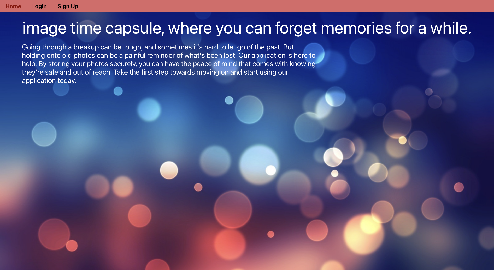

# Image Time Capsule

### Description 

Image Time Capsule is a web application that allows users to upload and store images, creating a digital time capsule of their memories. This README file contains information about the front-end development of the application.

### Authentication and Authorization
- The application uses JSON Web Tokens (JWT) for user authentication and authorization. 
- JWTs are sent in the headers authorization of requests to protected resources.

### Secure Communication and Custom Domain
- The application is hosted on Amplify and utilizes secure communication between RDS and Elastic Beanstalk. 
- The HTTPS protocol is configured on ELB, and a custom domain is used to ensure secure communication. 
- Certificate Manager and DNS are also used for SSL to further enhance security.

### Server Cost Optimization
To reduce server costs, we compared costs and migrated from Heroku to AWS cloud services. As a result, server costs were reduced by 90%.

### Installation
To run the application locally, follow these steps:

1. Clone the repository.
2. Install the necessary dependencies using npm install.
3. Start the development server using npm start.
